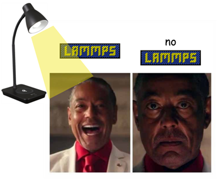
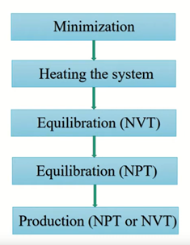

# Helium Bubbles in Silicates

The following LAMMPS input files and Python codes are for the purpose of simulating the implantation of helium and the formation of helium bubbles. If you have questions, email or Discord me (al2vy@virginia.edu). 


## Installation

The instructions for installing LAMMPS are [here](https://docs.lammps.org/Install.html). The Pedone potential was added in the 17Apr2024 version of LAMMPS so you may have to download the source code and build it yourself (or maybe by the time you are reading this there is an executable version of 17Apr2024 available). It is recommended to use CMake to build following the [instructions](https://docs.lammps.org/Build_cmake.html) 

To build the whole of lammps (all packages), run 

```
cd lammps                # change to the LAMMPS distribution directory
mkdir build; cd build    # create and use a build directory
```
We created a preset with the packages used in the vesicle simulations which includes the packages `EXTRA-DUMP EXTRA-PAIR KSPACE MANYBODY MOLECULE REAXFF RIGID VORONOI 
 `
This may take 30-45 minutes:
```
cmake -C ../cmake/presets/vesicles_on.cmake ../cmake    
cmake --build .          
```

Then, install the LAMMPS executable into your system with

```
make install
```

> [!NOTE]
> If you encounter a missing package error and you have built LAMMPS using CMake, go to CMakeCache.txt in the /build folder of LAMMPS and set the package to ON. Then, rebuild by running the following in the /build folder.
> ```
> cmake --build .
> make install
> ```


## Run

Run using ```lmp -in input.lammps``` on your local computer or from a slurm file on Rivanna. I make an individual folder for each input file I test, so that the output files are stored in the same place. Make sure to run the slurm file or input file from the folder that it is located in, because there are some hardcoded filepaths. Some input files require command line arguments, such as ```lmp -in input.lammps -v arg VALUE```. 

My naming scheme for each folder is [lattice-name]-[run-type]-*(optional)*[try##]-[run-description]. The [lattice-name] describes the size of the lattice (*cube* is a 16a x 13b x 8c forsterite lattice, *deep-cube* is a 42a x 33b x 80c forsterite lattice) and the atom configurations are stored under /atoms/lattice-name. There are currently only two run-types (*relax* is system preparation and *bombard* is anything involving helium). 

For tungsten simulations, *deckard* refers to depth distribution simulations, where the lattice is reset in between each Helium bombardment, and *imogene* refers to implantation, where the lattice is not reset. (Blade Runner lol)

## Visualization

Visualization of the outputted dump file or data file is done using [OVITO](https://www.ovito.org/) (preferred) or [VMD](https://www.ks.uiuc.edu/Research/vmd/). 

The thermo *.out file can be parsed and graphed using the Python scripts in the /graphing folder. These scripts will require tweaking depending on what system property you want to graph (temperature, pressure, number of Helium atoms, msd, etc). Per-atom properties (Voronoi volume, potential energy, etc) are outputted through custom dump files.

## Lattice Initialization

I exported the unit cell from [Materials Project](https://next-gen.materialsproject.org/materials/mp-2895) as a CIF file and used LAMMPS to replicate it. Do not use VESTA to create a supercell because it will cause duplicate atoms for some reason.

## Relaxation



The flow chart is based on this [video](https://www.youtube.com/watch?v=YyW_aTkkvRA) and this [article](https://www.compchems.com/setting-up-a-molecular-dynamics-simulation/#1-level-of-theory). Atomic configurations between each step are saved inside the /atoms folder. The Heating the System step is combined with Equilibration (NVT) and the production step is the actual run, which I used NVE for. After Equilibration (NPT), I measured the density of the lattice using the number of each atom and the volume of the system. Density calculations are in "my-vico-slides" linked below. MSD is a good way to tell when the system is relaxed enough, because it should reach a plateau. I added an extra step called Delete Atoms, which is when I extend the z-boundary to create a surface and run until the surface equilibrates. 

## Potentials

I could write ten pages about this but I will refrain <3 Potentials I've encountered include Pedone, Lennard-Jones, Beck, ReaxFF, ZBL, Buckingham, EAM, and tabular (the potentials are extrapolated from a table of separation distance and energy). The /potentials folder has potentials combinations that can be included into an input script. Below are some useful links and useful papers are in the folder /PAPERS-potentials. 

[wikipedia-intro](https://en.wikipedia.org/wiki/Interatomic_potential) |
[LAMMPS-provided](https://github.com/lammps/lammps/tree/develop/potentials) |
[my-desmos-graphs](https://www.desmos.com/calculator/epdz3mbrue) |
[lammps-docs](https://docs.lammps.org/pairs.html) |
[lennard-jones-mixing](https://mattermodeling.stackexchange.com/questions/4845/how-to-create-a-lookup-table-of-%CF%B5-and-%CF%83-values-for-lennard-jones-potentials) |
[NIST-repo](https://www.ctcms.nist.gov/potentials/) |
[openKIM](https://openkim.org/) |
[my-initial-notes](https://docs.google.com/document/d/1ayWn5OoLpytNzUDsMVmOIfqZ-FsfZ3EQrSmqDYfIQ94/edit?usp=sharing)

## Resources / My Notes

[LAMMPS-tutorials](https://lammpstutorials.github.io/): Thank you Simon Gravelle.

[eric-hahn](https://www.ericnhahn.com/tutorials/lammps-tutorials/pka): Hahn has posted several example input files but the most useful one is on PKA (primary knockoff radiation) and it's how I calculate velocity based on atom energy. 

[LAMMPS-workshops](https://www.lammps.org/workshops.html): These contain useful presentation slides but you have to search for them. I found the 2021 Virtual LAMMPS Workshop
and 2019 LAMMPS Workshop really useful.

[LAMMPS-examples](https://github.com/lammps/lammps/tree/develop/examples): Many different example input files provided with the source code. 

[polymer-metal](https://github.com/nuwan-d/polymer_metal_interface/tree/master): Example input files for a Polymer-Metal Interface. 

[my-vico-slides](https://docs.google.com/presentation/d/1MKdEB0VUCaLRqKrPCLoCm9mInB01r4ZEBdJBVm8v7ec/edit?usp=sharing): Assortment of troubleshooting logs, graphs, simulation GIFs, and vico presentation slides - my online lab notebook. 

[POTENTIAL-literature](https://docs.google.com/document/d/1zPFv_zNZtW1bYGkPBTmVatVFBc_XZnW0_Yc45QtuDUU/edit?usp=sharing): My notes on LAMMPS simulation publications and how they set up their systems with a focus on what potentials they used. 

[DATA-literature](https://docs.google.com/document/d/1Tbd0TCp1JN2RhIfcfsVkS9DOBiCg8Ad6f716GsS727g/edit?usp=sharing): My notes on LAMMPS simulation publications with a focus on what data they measured from helium bubbles and how. 

[BUBBLE-literature](https://docs.google.com/document/d/1jWwzUloeitPDnknGvaAquTfj3WpOw4dllaEzDrSO3zo/edit?usp=sharing): My notes on solar wind and helium in real experiments (not simulations). 

I added a bunch of comments to ```example_bombard.lammps```. Good luck and have fun!